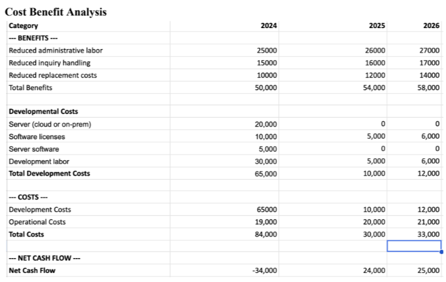
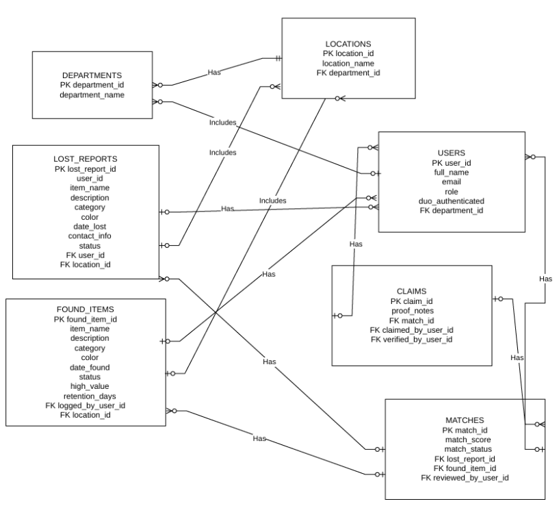
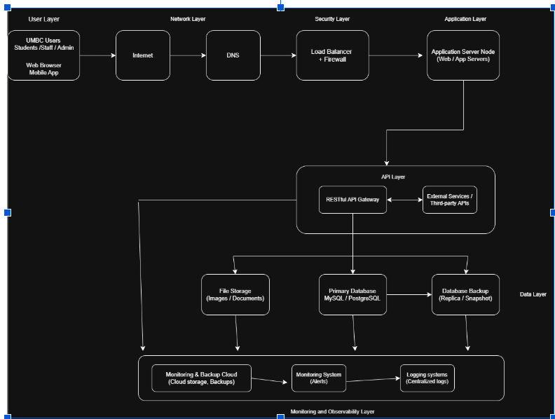
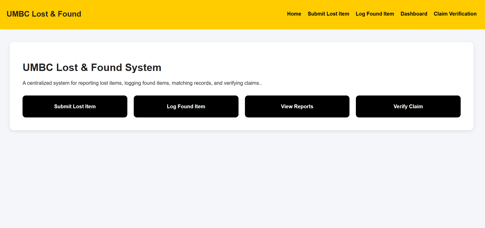
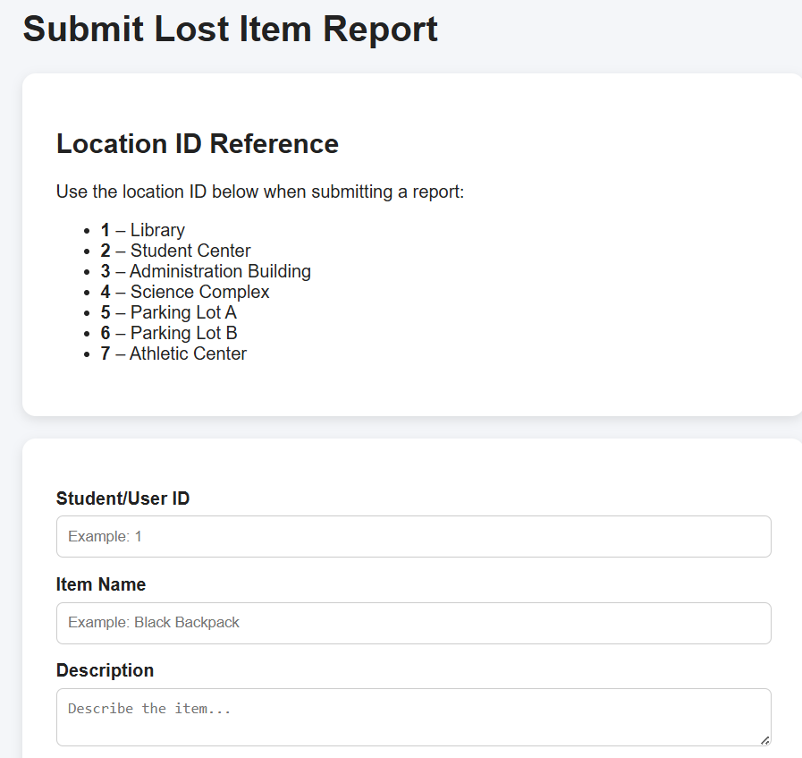
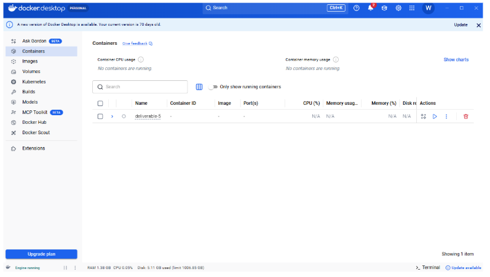

# UMBC Lost and Found System

The UMBC Lost & Found System is a centralized web application designed to help students and staff report lost items, log found items, automatically identify possible matches, and assist with claim verification.


---

# Table of Contents

1. [Project Overview](#1-project-overview)  
2. [Financial Projection](#2-financial-projection)  
3. [Interview Insights](#3-interview-insights)  
4. [User Needs](#4-user-needs)  
5. [Use Case Diagram](#5-use-case-diagram)  
6. [Database Design](#6-database-design)  
7. [Technology Components](#7-technology-components)  
8. [System Architecture](#8-system-architecture)  
9. [User Interface Design](#9-user-interface-design)  
10. [GitHub, Workflow, and Deployment](#10-github-workflow-and-deployment)  
11. [Live Demonstration](#11-live-demonstration)  
  

---

# 1. Project Overview

## Introduction

### Project Purpose
- Project Purpose: Digitize and automate the current lost and found system.
- Target Users: UMBC staff and students
- Problem Being Solved: The current physical lost and found system in place
- Expected Outcome: A log that keeps track of items and creates an efficient and smooth process

---

## Project Timeline

| Phase | Start Date | End Date | Description |
|-------|-------------|----------|-------------|
| System Request | 02/15/2026 | 02/22/2026 | Created a system request with a feasability and cost benefit analysis|
| Requirements Definition Document and Use Cases | 03/08/2026 | 03/15/2026 | Function/non-functional requirements, interview information, use case analysis |
| Docker | 03/29/2026 | 04/05/2026 | Creating our project database in docker |
| Data Modeling and Design | 04/19/2026 | 04/26/2026 | SQL Scripts, single alternative matrix, architecture diagram, complete System architecture diagram |
| Demo and Presentation | 05/04/2026 | 05/11/2026 | Live demo and presentation |

---

## Stakeholders

- Students – Primary users of the platform
- Faculty/Staff – Operational and academic users
- Administrators – System management and oversight
- Development Team – Builds and maintains the application
- IT Support Team – Infrastructure, security, and monitoring
- University Leadership – Project approval and funding
- Third-Party Service Providers – External integrations and cloud hosting

---

# 2. Financial Projection

## Cost Benefit Analysis



---

# 3. Interview insights

##Interview 1
Interviewee: Campus Center Front Desk Staff Member
Position: Front Desk Supervisor

Questions asked (Open-Ended)
1. Can you describe how the lost and found process currently works?
2. What types of items do you think are most commonly reported lost?
3. What challenges have you faced when you were trying to return items to students?

Questions asked(Closed)
1. Are you currently using any digital tools to track lost items?
2. Do you think a centralized online system improves the process?
3. Would automated email notifications help students recover items faster?

### Interview 1 Summary 
The Campus Center currently manages lost items using a manual logbook system. First, staff
record item descriptions in a notebook or using some documents and store items in physical
storage areas. In addition, students must visit the front desk to check if their items were found.
Staff reported that this process is time consuming and difficult to search. We believe that a
centralized digital system with search capabilities and automated matching would improve
efficiency.

## Interview 2
Interviewee: UMBC Undergraduate Student
Position: Student

Questions (Open-Ended)
1. Have you ever lost an item on campus before? If so, when?
2. What did you do after realizing your item was missing?
3. Were you aware of the campus lost and found service?

Questions (Closed)
1. Would you prefer submitting a lost item report online?
2. Would email notifications help you recover items faster?

### Interview 2 Summary
The student reported that many students are unaware of where the campus lost and found is
located. They have stated that an online reporting system would make it quite easier to report
these lost items and check for matches without visiting the front desk all the time.
---

# 4. User Requirements

## User Case 1
Description: Submiting lost item ticket
Priority:High
Reason: Submitting a ticket is vital for the system to being functional and to keep track of lost items

## Use Case 2
Description: Staff log found item
Priority: High
Reason: It is important to keep track of any item that comes across the system. This is to match with lost item tickets

## Use Case 3
Description: Automated matching
Priority: High
Reason: Creates an efficient process for matching items with tickets

---

# 5. Use Case Diagram


---

# 6. Database Design

## ER Diagram


## SQL Scripts
```SQL script
-- =========================================================
-- UMBC Lost & Found System Database Script
-- IS 436 Deliverable 4 - Data Modeling and Starting Design
-- This single SQL file creates all database tables and inserts sample data.
-- Database: PostgreSQL
-- =========================================================
-- =========================================================
-- Optional cleanup section
-- Drops tables in reverse dependency order so the script can be rerun.
-- =========================================================
DROP TABLE IF EXISTS claims;
DROP TABLE IF EXISTS matches;
DROP TABLE IF EXISTS found_items;
DROP TABLE IF EXISTS lost_reports;
DROP TABLE IF EXISTS users;
DROP TABLE IF EXISTS locations;
DROP TABLE IF EXISTS departments;
-- =========================================================
-- TABLE CREATION SECTION
-- =========================================================
-- Departments
CREATE TABLE departments (
department_id SERIAL PRIMARY KEY,
department_name VARCHAR(100) NOT NULL UNIQUE
);
-- Locations
CREATE TABLE locations (
location_id SERIAL PRIMARY KEY,
location_name VARCHAR(100) NOT NULL,
department_id INT REFERENCES departments(department_id)
);
-- Users: students, staff, police, and administrators
CREATE TABLE users (
user_id SERIAL PRIMARY KEY,
full_name VARCHAR(100) NOT NULL,
email VARCHAR(100) UNIQUE NOT NULL,
role VARCHAR(30) NOT NULL,
duo_authenticated BOOLEAN DEFAULT FALSE,
department_id INT REFERENCES departments(department_id),
created_at TIMESTAMP DEFAULT CURRENT_TIMESTAMP
);
-- Lost item reports submitted by students/users
CREATE TABLE lost_reports (
lost_report_id SERIAL PRIMARY KEY,
user_id INT REFERENCES users(user_id),
item_name VARCHAR(100) NOT NULL,
description TEXT NOT NULL,
category VARCHAR(50),
color VARCHAR(50),
date_lost DATE,
location_id INT REFERENCES locations(location_id),
contact_info VARCHAR(100),
status VARCHAR(30) DEFAULT 'lost',
created_at TIMESTAMP DEFAULT CURRENT_TIMESTAMP
);
-- Found items logged by staff members
CREATE TABLE found_items (
found_item_id SERIAL PRIMARY KEY,
logged_by_user_id INT REFERENCES users(user_id),
item_name VARCHAR(100) NOT NULL,
description TEXT NOT NULL,
category VARCHAR(50),
color VARCHAR(50),
date_found DATE,
location_id INT REFERENCES locations(location_id),
status VARCHAR(30) DEFAULT 'found',
high_value_flag BOOLEAN DEFAULT FALSE,
retention_days INT,
created_at TIMESTAMP DEFAULT CURRENT_TIMESTAMP
);
-- Matches between lost item reports and found items
CREATE TABLE matches (
match_id SERIAL PRIMARY KEY,
lost_report_id INT REFERENCES lost_reports(lost_report_id),
found_item_id INT REFERENCES found_items(found_item_id),
match_score DECIMAL(5,2),
reviewed_by_user_id INT REFERENCES users(user_id),
match_status VARCHAR(30) DEFAULT 'pending',

created_at TIMESTAMP DEFAULT CURRENT_TIMESTAMP
);
-- Claims for verified item returns
CREATE TABLE claims (
claim_id SERIAL PRIMARY KEY,
match_id INT REFERENCES matches(match_id),
claimed_by_user_id INT REFERENCES users(user_id),
verified_by_user_id INT REFERENCES users(user_id),
proof_notes TEXT,
claim_datetime TIMESTAMP DEFAULT CURRENT_TIMESTAMP
);
-- =========================================================
-- INSERT DATA SECTION
-- =========================================================
-- Insert departments
INSERT INTO departments (department_name) VALUES
('Campus Center'),
('UMBC Police'),
('Residential Life'),
('Facilities Management');
-- Insert locations
INSERT INTO locations (location_name, department_id) VALUES
('Commons Front Desk', 1),
('Police Office', 2),
('Patapsco Hall Desk', 3),
('Retriever Learning Center', 4);
-- Insert users
INSERT INTO users (full_name, email, role, duo_authenticated, department_id) VALUES
('Wilson Zhang', 'wzhang4@umbc.edu', 'student', TRUE, 1),
('Campus Center Staff', 'staff1@umbc.edu', 'staff', TRUE, 1),
('Police Officer', 'officer1@umbc.edu', 'police', TRUE, 2),
('Dorm Staff', 'dormstaff1@umbc.edu', 'staff', TRUE, 3);
-- Insert lost reports
INSERT INTO lost_reports
(user_id, item_name, description, category, color, date_lost, location_id, contact_info, status)
VALUES
(1, 'Water Bottle', 'Black Hydro Flask lost in the Game Room', 'Bottle', 'Black', '2026-03-10', 1, 'wzhang4@umbc.edu', 'lost'),
(1, 'Student ID Card', 'UMBC student ID lost near library entrance', 'ID Card', 'White', '2026-03-11', 4, 'wzhang4@umbc.edu', 'lost');
-- Insert found items
INSERT INTO found_items
(logged_by_user_id, item_name, description, category, color, date_found, location_id, status, high_value_flag, retention_days)
VALUES
(2, 'Water Bottle', 'Black metal bottle/hydro flask found at Commons desk', 'Bottle', 'Black', '2026-03-11', 1, 'found', FALSE, 30),
(3, 'Student ID Card', 'UMBC ID card turned in to campus police', 'ID Card', 'White', '2026-03-12', 2, 'found', TRUE, 395);
-- Insert matches
INSERT INTO matches
(lost_report_id, found_item_id, match_score, reviewed_by_user_id, match_status)
VALUES
(1, 1, 92.50, 2, 'confirmed'),
(2, 2, 97.00, 3, 'confirmed');
-- Insert claims
INSERT INTO claims
(match_id, claimed_by_user_id, verified_by_user_id, proof_notes)
VALUES
(1, 1, 2, 'Student showed campus ID and described the bottle correctly');
-- =========================================================
-- Verification Queries
-- These can be run after the script to verify the database tables.
-- =========================================================
SELECT * FROM departments;
SELECT * FROM locations;
SELECT * FROM users;
SELECT * FROM lost_reports;
SELECT * FROM found_items;
SELECT * FROM matches;
SELECT * FROM claims;
```

---

# 7. Technology Stack

## Software
- Node.js
- Express.js
- PostgreSQL
- Docker
- Docker Compose
- GitHub Actions
- DockerHub
- Render Cloud Hosting
- HTML
- CSS
- JavaScript

## Hardware
- Laptops/Computers

---

# 8. System Architecture

## System Architecure Diagram


## Architectural Justification

This system uses a layered architecture to separate responsibilities across the user, network, security, application, API, data, and monitoring layers. This improves system organization, maintainability, and allows components to be updated independently.

### Scalability
A load balancer and multiple application servers allow the system to handle increased traffic by distributing requests efficiently.

### Security
A firewall and isolated API/data layers protect the system from unauthorized access and reduce security risks.

### Reliability
The use of a primary database, backup database, and cloud backups ensures data availability and supports disaster recovery.

### Performance
Separating application services, file storage, and database operations improves response times and prevents resource bottlenecks.

### Monitoring
Centralized logging and alert systems help detect issues quickly and maintain system stability.

---

# 9. User Interface Design

## UI Example 1


### Purpose
This is the home page where you can navigate to any screen you need. If you are looking to submit a lost ticket or a found item.

### Design idea
Kept simple for now for demo and testing reasons


## UI Example 2


### Purpose
This is the lost ticket submission. You fill out the following information based on the lost item.

### Design idea
Kept simple for now for demo and testing reasons


## Tradeoffs

### Implementing the Automated Matching View

Right now, the dashboard displays "Lost Reports" and "Found Items" as two 
completely separate tables.

The Improvement: Create a third dashboard view specifically for the matches 
table defined in our SQL schema. This would surface the match_score 
directly to the staff, showing them high-probability links (e.g., matching a 
"Black Bottle" in lost to a "Black Bottle" in found).

#### The Tradeoff:

Pros: This fulfills the core "Advanced Feature" for our system request, 
significantly reducing the manual cognitive load on campus staff. It proves the 
system is an active matching engine and not just a passive logbook.

Cons: It increases backend complexity. You have to write the algorithm to 
generate that match_score upon data entry, or run a scheduled backend job 
to cross-reference new entries, which introduces potential performance 
overhead as the database grows.

### Interactive Status Toggles

Currently, the Status column ("lost", "found", "confirmed") is static text.

The Improvement: Change the status text into interactive dropdowns or 
action buttons (e.g., a "Mark as Claimed" button) directly on the dashboard 
row.

#### The Tradeoff:

Pros: Creates a seamless workflow. Staff can update an item's status without 
having to navigate away to a separate "Claim Verification" form and manually 
type in the item ID.

Cons: Requires writing asynchronous JavaScript (AJAX/Fetch) functions on the 
frontend to send UPDATE requests back to the server without reloading the 
page, adding another layer of state management to the application.
---

# 10. GitHub, Workflow, and Docker

##Github code
https://github.com/wzhang4-commits/Deliverable-5

## Workflow
We would have weekly meetings in order to split up tasks and discuss the progress of our project. We would always use github for the project 
managment side to organize tasks and keep up their status. 

## Docker

---

# 11. Live Demonstration

## 1. Launch Web application

Open the website using the URL

## 2. Main Feature

### Submit Lost Item
Users can submit lost item reports which are stored in the PostgreSQL database.

### Log Found Item
Staff members can log found items into the system.

### Automatic Matching
When a found item is submitted, the system compares:
- item name
- category
- color

If a match is found, the lost report status is updated to:
- Matched

### Dashboard Reports
The dashboard displays:
- Lost Reports
- Found Items
- Match Status

### Claim Verification Prototype
The system includes a prototype claim verification interface for staff review.

## 3. Data processing
Data is put into each table when a ticket is submitted or when a lost item is found. The data can be displayed through the dashboard along with information about each item.

